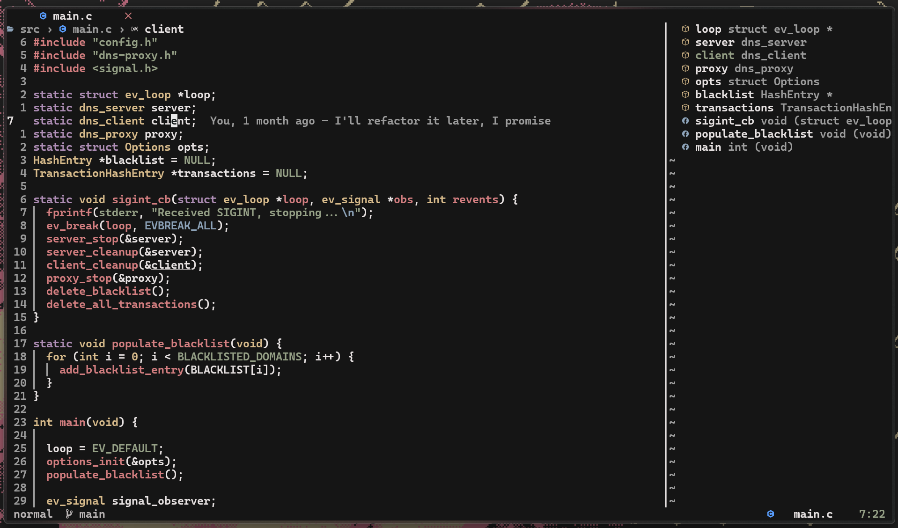
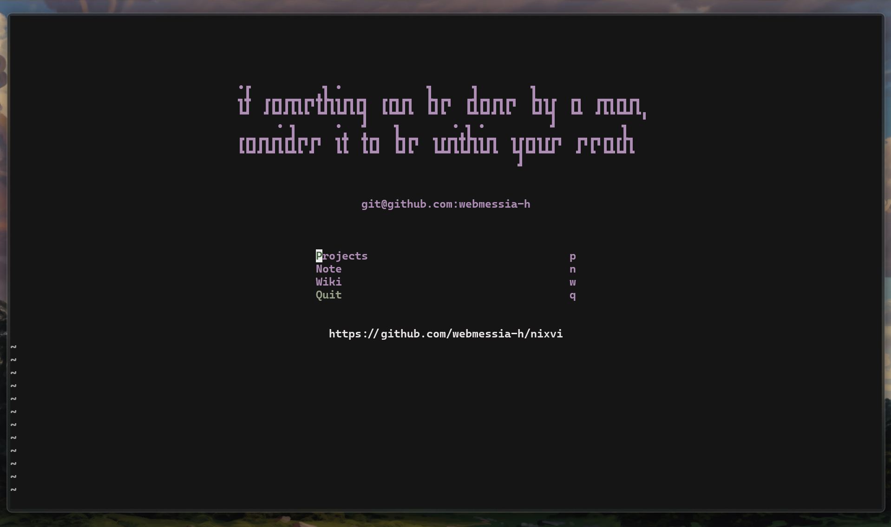
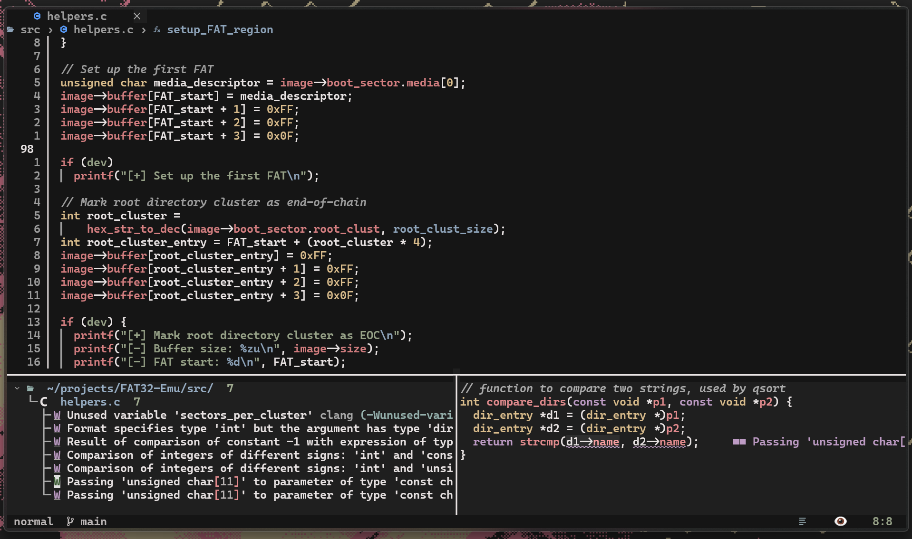
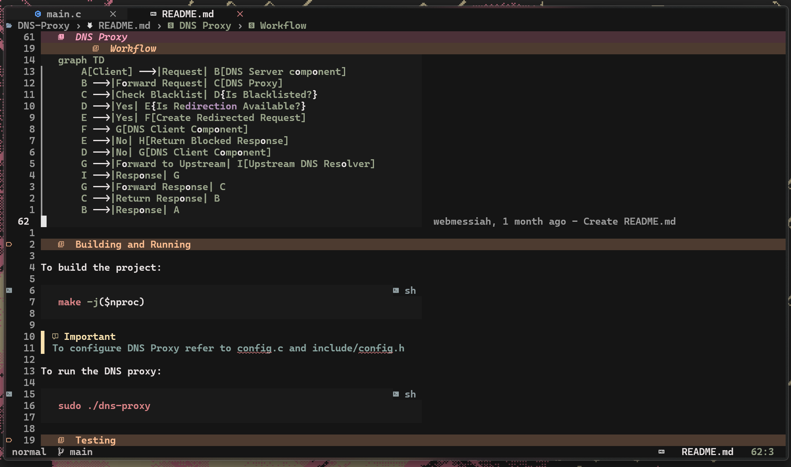
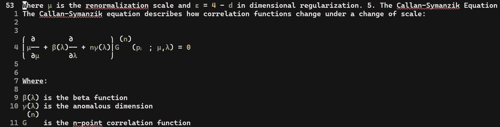

<div align="center">
    
 <a href="https://git.io/typing-svg"></a>
    
</div>

<h1 align="center"> Nixvim-based Neovim configuration 
    <br>focused on C/C++ development </h1>



<details>
    <summary>More</summary>
    
    
    
    
    
    </details>

## Configuring

To start configuring, just add or modify the nix files in `./config`.
If you add a new configuration file, remember to add it to the
[`config/default.nix`](../config/default.nix) file

### Current plugins

### Current plugins

- **[colorscheme/](../config/plug/colorscheme):** Theme configuration. Current one is [paradise](https://github.com/paradise-theme/paradise)

  - **[biscuit](../config/plug/colorscheme/biscuit.nix):** (additional theme)

- **[completion/](../config/plug/completion)**

  - **[nvim-cmp](../config/plug/completion/cmp.nix):** Completion plugin for nvim + emoji support
  - **[lspkind](../config/plug/completion/lspkind.nix):** vscode-like pictograms for neovim lsp completion items

- **[git/](../config/plug/git)**

  - **[gitlinker](../config/plug/git/gitlinker.nix):** Generate shareable file permalinks
  - **[gitsigns](../config/plug/git/gitsigns.nix):** Git integration for buffers
  - **[lazygit](../config/plug/git/lazygit.nix):** The **best** git TUI, as a neovim plugin
  - **[worktree](../config/plug/git/worktree.nix):** Make using git worktrees easier
  - **[gitpad](../config/plug/git/gitpad.nix):** Provides minimal per-Project/File/Branch note taking
  - **[gitblame](../config/plug/git/gitblame.nix):** Show git blame information

- **[lsp/](../config/plug/lsp)**

  - **[conform](../config/plug/lsp/conform.nix):** Formatter plugin
  - **[fidget](../config/plug/lsp/fidget.nix):** LSP progress notifications
  - **[hlchunk](../config/plug/lsp/hlchunk.nix):** Highlight useful things like current chunk or indent lines
  - **[lsp](../config/plug/lsp/lsp.nix):** LSP configs
  - **[lspsaga](../config/plug/lsp/lspsaga.nix):** Cool LSP features
  - **[none-ls](../config/plug/lsp/none-ls.nix):** null-ls replacement. Use nvim as LSP
  - **[clangd-extensions](../config/plug/lsp/clangd-extensions.nix):** Inlay hints and much more

- **[snippet/](../config/plug/snippet)**

  - **[luasnip](../config/plug/snippet/luasnip.nix):** Snippet engine in lua

- **[statusline/](../config/plug/statusline)**

  - **[lualine](../config/plug/statusline/lualine.nix):** Status line for neovim
  - **[staline](../config/plug/statusline/staline.nix):** Some Soviet guy that died a long time ago (**commented out**)

- **[treesitter/](../config/plug/treesitter)**

  - **[treesitter-context](../config/plug/treesitter/treesitter-context.nix):** Show code context
  - **[treesitter-textobject](../config/plug/treesitter/treesitter-textobject.nix):** Allow cool text manipulation thanks to TS
  - **[treesitter](../config/plug/treesitter/treesitter.nix):** Parser generator tool to build a syntax tree of the current buffer

- **[ui/](../config/plug/ui)**

  - **[alpha](../config/plug/ui/alpha.nix):** Dashboard
  - **[bufferline](../config/plug/ui/bufferline.nix):** VSCode-like line for buffers
  - **[noice](../config/plug/ui/noice.nix):** Better nvim UI
  - **[nvim-notify](../config/plug/ui/nvim-notify.nix):** Notification manager
  - **[telescope](../config/plug/ui/telescope.nix):** Best plugin ever
  - **[project](../config/plug/ui/project.nix):** Project managing
  - **[web-devicons](../config/plug/ui/web-devicons.nix):** Adds file type icons
  - **[dressing](../config/plug/ui/dressing.nix):** Improved UI for `vim.ui` interfaces
  - **[smart-splits](../config/plug/ui/smart-splits.nix):** Resize splits more intelligently
  - **[indent-blankline](../config/plug/ui/indent-blankline.nix):** Adds indentation guides
  - **[image-nvim](../config/plug/ui/image-nvim.nix):** Render images in markdown (**commented out**)
  - **[nabla](../config/plug/ui/nabla.nix):** LaTeX support (not used anymore; **commented out**)

- **[utils/](../config/plug/utils)**

  - **[comment](../config/plug/utils/comment.nix):** Quickly toggle comments
  - **[comment-box](../config/plug/utils/comment-box.nix):** Comment utilities
  - **[flash](../config/plug/utils/flash.nix):** Navigate in file with a few keystrokes
  - **[grapple](../config/plug/utils/grapple.nix):** Quickly switch between buffers (Harpoon replacement)
  - **[hardtime](../config/plug/utils/hardtime.nix):** Learn vim motions, the hard way
  - **[illuminate](../config/plug/utils/illuminate.nix):** Highlight word under the cursor
  - **[markview](../config/plug/utils/markview.nix):** Yet another markdown previewer for neovim
  - **[mini](../config/plug/utils/mini.nix):** Cool neovim utilities, currently using `ai`, `notify`, and `surround`
  - **[nvim-autopairs](../config/plug/utils/nvim-autopairs.nix):** Autopairs in nvim
  - **[nvim-colorizer](../config/plug/utils/nvim-colorizer.nix):** Preview colors in neovim
  - **[obsidian](../config/plug/utils/obsidian.nix):** Obsidian integration for nvim
  - **[oil](../config/plug/utils/oil.nix):** Navigate in your working folder with a buffer
  - **[ufo](../config/plug/utils/ufo.nix):** Folding plugin
  - **[undotree](../config/plug/utils/undotree.nix):** Undo history visualizer
  - **[whichkey](../config/plug/utils/whichkey.nix):** Popup to display keybindings
  - **[trouble](../config/plug/utils/trouble.nix):** Pretty interface for working with LSP
  - **[wakatime](../config/plug/utils/wakatime.nix):** Track your coding activity
  - **[neo-tree](../config/plug/utils/neo-tree.nix):** File explorer tree
  - **[graph](../config/plug/utils/graph.nix):** Mermaid diagrams renderer (**commented out**)
  - **[harpoon](../config/plug/utils/harpoon.nix):** Quickly switch between buffers (**commented out**)
  - **[vim-be-good](../config/plug/utils/vim-be-good.nix):** Game to practice Vim skills (**commented out**)

  ## Testing your new configuration

To test your configuration simply run the following command

```shell
nix run .
```

If you have nix installed, you can directly run my config from anywhere

You can try running mine with:

```shell
nix run 'github:webmessia-h/nixvi'
```

## Installing into NixOS configuration

This `nixvim` flake will output a derivation that you can easily include
in either `home.packages` for `home-manager`, or
`environment.systemPackages` for `NixOS`. Or whatever happens with darwin?

You can add my `nixvim` configuration as an input to your `NixOS` configuration like:

```nix
{
 inputs = {
    nixvim.url = "github:webmessia-h/nixvi";
 };
}
```

### Direct installation

With the input added you can reference it directly.

```nix
{ inputs, system, ... }:
{
  # NixOS
  environment.systemPackages = [ inputs.nixvim.packages.${pkgs.system}.default ];
  # home-manager
  home.packages = [ inputs.nixvim.packages.${pkgs.system}.default ];
}
```

The binary built by `nixvim` is already named as `nvim` so you can call it just
like you normally would.

### Installing as an overlay

Another method is to overlay your custom build over `neovim` from `nixpkgs`.

This method is less straight-forward but allows you to install `neovim` like
you normally would. With this method you would just install `neovim` in your
configuration (`home.packges = with pkgs; [ neovim ]`), but you replace
`neovim` in `pkgs` with your derivation from `nixvim`.

```nix
{
  pkgs = import inputs.nixpkgs {
    overlays = [
      (final: prev: {
        neovim = inputs.nixvim.packages.${pkgs.system}.default;
      })
    ];
  }
}
```

### Bonus lazy method

You can just straight up alias something like `nix run
'github:webmessia-h/nixvi'` to `nvim` or `vi` or `vim`.

### Bonus extend method

If you want to extend this config is your own NixOS config, you can do so using `nixvimExtend`. See [here](https://nix-community.github.io/nixvim/modules/standalone.html) for more info.

Example for overwritting the theme

```nix
{
  inputs,
  lib,
  ...
}: let
  nixvim' = inputs.nixvim.packages."x86_64-linux".default;
  nvim = nixvim'.nixvimExtend {
    config.theme = lib.mkForce "jellybeans";
  };
in {
  home.packages = [
    nvim
  ];
}
```
